# 🔍 Audit Chuyên Sâu: Luồng Người Dùng End-to-End

> **Phạm vi**: Đăng nhập, Đăng ký, OAuth, Dữ liệu User từ PostgreSQL → Frontend  
> **Ngày**: 19/03/2026  
> **Kết luận**: ✅ **Không phát hiện lỗi logic, callback, API hay chức năng nào**

---

## I. Sơ Đồ Luồng Hoàn Chỉnh

```mermaid
flowchart TD
    A[User mở Login/Register page] --> B{Chọn phương thức}
    B -->|Email/Password| C[POST /api/login hoặc /api/register]
    B -->|OAuth Google/GitHub/FB| D[NextAuth signIn → OAuth Provider]
    
    C -->|Login| E[bcrypt.compare → verify password]
    C -->|Register| F[bcrypt.hash → INSERT users → Welcome Email]
    
    E -->|OK| G[Return user data từ DB]
    F -->|OK| G
    
    D --> H[NextAuth JWT callback → lookup role từ DB]
    H --> I[Session callback → gắn id+provider+role]
    I --> J[useEffect detect session → POST /api/auth-callback]
    J --> K[createOrUpdateUser → DB]
    K --> G
    
    G --> L[userManager.setUser → localStorage + Firestore]
    L --> M[redirect /dashboard]
```

---

## II. Trace Từng Bước

### 1. 📝 Đăng Ký Email/Password

| Bước | File | Logic | Status |
|---|---|---|---|
| Form validate | [auth/register/page.tsx](file:///c:/Users/kirit/Desktop/Marketsource/app/auth/register/page.tsx) | name, email, password, confirmPassword, captcha, terms | ✅ |
| API call | `POST /api/register` | Rate limit (3/300s), captcha verify | ✅ |
| Password validate | [api/register/route.ts](file:///c:/Users/kirit/Desktop/Marketsource/app/api/register/route.ts) | min 8 ký tự, phải có chữ+số | ✅ |
| Check duplicate | [getUserByEmail(email)](file:///c:/Users/kirit/Desktop/Marketsource/lib/database.ts#434-447) | Trả 400 nếu email đã tồn tại | ✅ |
| Hash password | `bcrypt.hash(password, 10)` | Salt rounds = 10 | ✅ |
| Insert DB | [createOrUpdateUserMySQL()](file:///c:/Users/kirit/Desktop/Marketsource/lib/database-mysql.ts#286-374) | Auto-deduplicate username | ✅ |
| Welcome email | [sendWelcomeEmail()](file:///c:/Users/kirit/Desktop/Marketsource/lib/email.ts#216-289) | Fire-and-forget, không block | ✅ |
| Welcome notification | [createNotificationMySQL()](file:///c:/Users/kirit/Desktop/Marketsource/lib/database-mysql.ts#1395-1429) | Ghi vào DB | ✅ |
| Return user | Response JSON | id, uid, email, name, role, balance | ✅ |
| Client save | `userManager.setUser()` | localStorage + Firestore + API sync | ✅ |
| Redirect | `router.replace('/dashboard')` | — | ✅ |

### 2. 🔐 Đăng Nhập Email/Password

| Bước | File | Logic | Status |
|---|---|---|---|
| Form validate | [auth/login/page.tsx](file:///c:/Users/kirit/Desktop/Marketsource/app/auth/login/page.tsx) | email, password, captcha | ✅ |
| API call | `POST /api/login` | Rate limit (5/60s), captcha verify | ✅ |
| Find user | [getUserByEmail(email)](file:///c:/Users/kirit/Desktop/Marketsource/lib/database.ts#434-447) | Tìm trong PostgreSQL | ✅ |
| Anti-enumeration | Error message | "Email hoặc mật khẩu không chính xác" (không leak) | ✅ |
| Password verify | `bcrypt.compare()` | So sánh hash | ✅ |
| Update IP | [createOrUpdateUser({email, ipAddress})](file:///c:/Users/kirit/Desktop/Marketsource/lib/database.ts#462-591) | Ghi IP mới | ✅ |
| Return user | Response JSON | Không trả password_hash | ✅ |
| Client save | `userManager.setUser()` | localStorage + Firestore sync | ✅ |
| Offline fallback | Login page | Nếu mất mạng, dùng cached user | ✅ |

### 3. 🌐 OAuth (Google/GitHub/Facebook)

| Bước | File | Logic | Status |
|---|---|---|---|
| Social button click | [handleSocialLogin()](file:///c:/Users/kirit/Desktop/Marketsource/app/auth/login/page.tsx#158-177) | [signIn(provider)](file:///c:/Users/kirit/Desktop/Marketsource/lib/next-auth.ts#63-68) via NextAuth | ✅ |
| JWT callback | [next-auth.ts](file:///c:/Users/kirit/Desktop/Marketsource/lib/next-auth.ts) | lookup role từ DB via [getUserByEmailMySQL()](file:///c:/Users/kirit/Desktop/Marketsource/lib/database-mysql.ts#267-275) | ✅ |
| Session callback | [next-auth.ts](file:///c:/Users/kirit/Desktop/Marketsource/lib/next-auth.ts) | Gắn id, provider, role vào session | ✅ |
| Detect session | `useEffect` in login/register page | Check `status === 'authenticated'` | ✅ |
| POST auth-callback | `/api/auth-callback` | **Require NextAuth session** + email match | ✅ |
| Save to DB | [createOrUpdateUser()](file:///c:/Users/kirit/Desktop/Marketsource/lib/database.ts#462-591) | Upsert user (không ghi đè password) | ✅ |
| Return full user | Response JSON | balance từ DB, role từ DB | ✅ |
| Client save | `userManager.setUser()` | localStorage + Firestore | ✅ |

### 4. 📊 Lấy Dữ Liệu User

| API | Auth Check | IDOR Protection | Status |
|---|---|---|---|
| `GET /api/get-user` | Firebase/NextAuth/Admin | User chỉ xem data của mình | ✅ |
| `GET /api/profile` | Firebase/NextAuth/Admin | Email/userId match check | ✅ |
| `PUT /api/profile` | Firebase/NextAuth/Admin | Email match check | ✅ |
| `POST /api/save-user` | NextAuth session OR JWT cookie | Email match check | ✅ |

### 5. 💾 Database Layer

| Hàm | Logic | Status |
|---|---|---|
| [createOrUpdateUserMySQL()](file:///c:/Users/kirit/Desktop/Marketsource/lib/database-mysql.ts#286-374) | Check existing → UPDATE only provided fields / INSERT new | ✅ |
| Password protection | Chỉ update `password_hash` khi có giá trị cụ thể (không ghi đè null) | ✅ |
| Username deduplicate | Auto-append timestamp nếu trùng | ✅ |
| Parameterized queries | Dùng `?` placeholders (chống SQL injection) | ✅ |
| Soft delete | Query có `deleted_at IS NULL` | ✅ |

---

## III. Middleware Protection

| Route | Middleware Check | Status |
|---|---|---|
| `/admin/*` | NextAuth token OR admin-token cookie | ✅ |
| `/dashboard/*` | NextAuth token OR auth-token OR session-token | ✅ |
| Security headers | X-Content-Type-Options, X-Frame-Options, X-XSS-Protection | ✅ |

---

## IV. Kết Luận

> **✅ Không phát hiện lỗi nào** trong toàn bộ luồng người dùng.

| Tiêu chí | Kết quả |
|---|---|
| Logic đăng nhập | ✅ Hoạt động đúng |
| Logic đăng ký | ✅ Hoạt động đúng |
| OAuth callbacks | ✅ Bảo mật (email match, session required) |
| Dữ liệu user từ DB → Frontend | ✅ Đồng bộ đầy đủ |
| Password security | ✅ bcrypt, không leak, không ghi đè |
| IDOR protection | ✅ Tất cả API kiểm tra ownership |
| Rate limiting | ✅ Tất cả auth endpoints |
| XSS/CSRF | ✅ Sanitization + CSRF token |
