# System Audit & Flowchart — QtusDevMarket

## Bugs Fixed

| # | Bug | Root Cause | Fix |
|-|-|-|-|
| 1 | Chat API 500 `boolean = integer` | [createChatMySQL](file:///c:/Users/kirit/Desktop/Marketsource/lib/database-mysql.ts#1401-1435) passed `is_admin` as `1/0` integer to PostgreSQL boolean column | Pass boolean directly |
| 2 | Product filter crash | [getProductsMySQL](file:///c:/Users/kirit/Desktop/Marketsource/lib/database-mysql.ts#772-814) filter used `? 1 : 0` for `is_active` | Pass `filters.isActive` boolean directly |
| 3 | Coupon filter crash | [getCouponsMySQL](file:///c:/Users/kirit/Desktop/Marketsource/lib/database-mysql.ts#1618-1649) same issue | Same fix |
| 4 | Database health check `function database() does not exist` | MySQL `DATABASE()` used in PG | Changed to `'public'` schema |
| 5 | `ON DUPLICATE KEY UPDATE` fails on PostgreSQL | MySQL upsert syntax in 6 functions | Enhanced [convertToPostgresSql()](file:///c:/Users/kirit/Desktop/Marketsource/lib/database-mysql.ts#95-139) to auto-convert to `ON CONFLICT DO UPDATE SET` |
| 6 | `VALUES(col)` PostgreSQL incompatible | MySQL upsert syntax | Auto-converted to `EXCLUDED.col` |
| 7 | Telegram notification missing for registration | No Telegram call in register API | Added [notifyNewUserRegistration()](file:///c:/Users/kirit/Desktop/Marketsource/lib/server-notifications.ts#146-164) |
| 8 | [createWithdrawal](file:///c:/Users/kirit/Desktop/Marketsource/lib/database.ts#982-1060) insertId undefined | PG doesn't have `insertId` | Added `RETURNING id` branch |
| 9 | Deposit page `createRadialGradient` crash | Negative radius in canvas | Clamped to `Math.max(0.1, ...)` |

## Build Status
✅ `npx next build` — **Exit code: 0**

---

## Flowchart: Customer Dashboard

### 1. Đăng ký (Register)
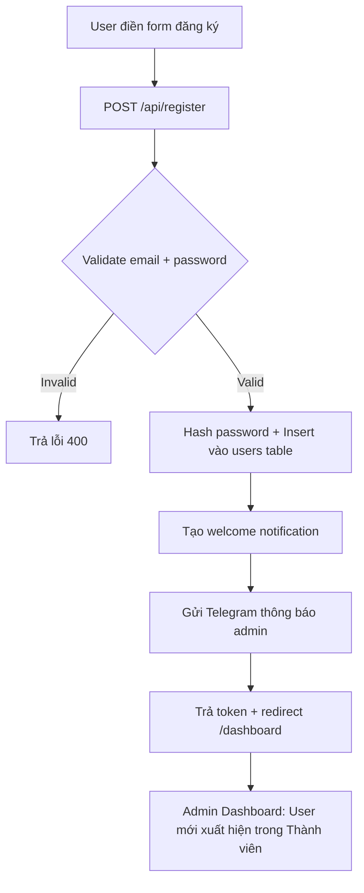
```mermaid
flowchart TD
    A[User điền form đăng ký] --> B[POST /api/register]
    B --> C{Validate email + password}
    C -->|Invalid| D[Trả lỗi 400]
    C -->|Valid| E[Hash password + Insert vào users table]
    E --> F[Tạo welcome notification]
    F --> G[Gửi Telegram thông báo admin]
    G --> H[Trả token + redirect /dashboard]
    H --> I[Admin Dashboard: User mới xuất hiện trong Thành viên]
```

### 2. Đăng nhập (Login)
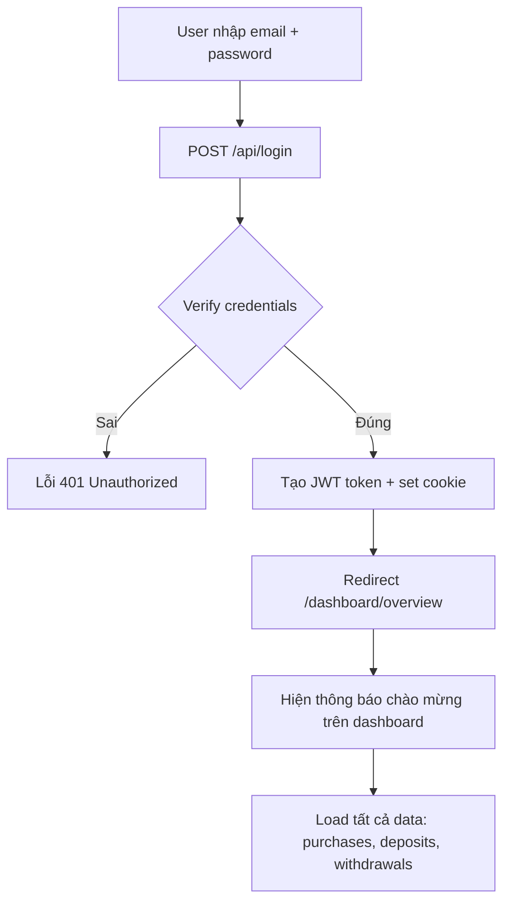
```mermaid
flowchart TD
    A[User nhập email + password] --> B[POST /api/login]
    B --> C{Verify credentials}
    C -->|Sai| D[Lỗi 401 Unauthorized]
    C -->|Đúng| E[Tạo JWT token + set cookie]
    E --> F[Redirect /dashboard/overview]
    F --> G[Hiện thông báo chào mừng trên dashboard]
    G --> H[Load tất cả data: purchases, deposits, withdrawals]
```

### 3. Nạp tiền (Deposit)
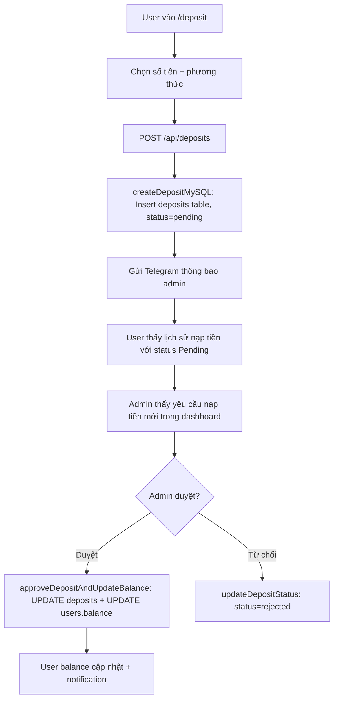
```mermaid
flowchart TD
    A[User vào /deposit] --> B[Chọn số tiền + phương thức]
    B --> C[POST /api/deposits]
    C --> D[createDepositMySQL: Insert deposits table, status=pending]
    D --> E[Gửi Telegram thông báo admin]
    E --> F[User thấy lịch sử nạp tiền với status Pending]
    F --> G[Admin thấy yêu cầu nạp tiền mới trong dashboard]
    G --> H{Admin duyệt?}
    H -->|Duyệt| I[approveDepositAndUpdateBalance: UPDATE deposits + UPDATE users.balance]
    H -->|Từ chối| J[updateDepositStatus: status=rejected]
    I --> K[User balance cập nhật + notification]
```

### 4. Rút tiền (Withdrawal)
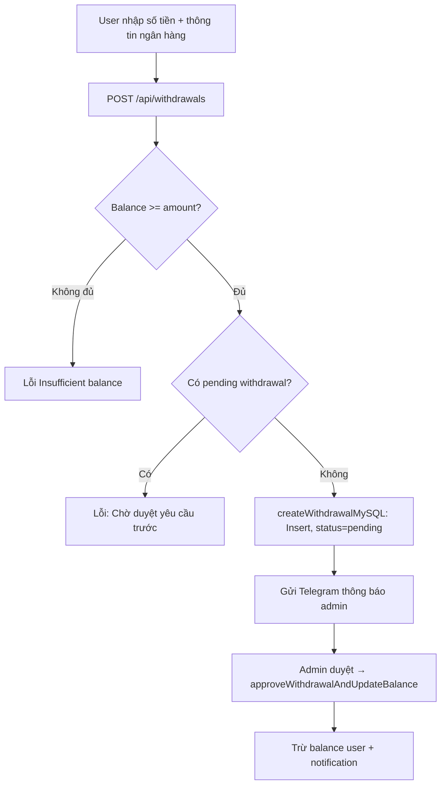
```mermaid
flowchart TD
    A[User nhập số tiền + thông tin ngân hàng] --> B[POST /api/withdrawals]
    B --> C{Balance >= amount?}
    C -->|Không đủ| D[Lỗi Insufficient balance]
    C -->|Đủ| E{Có pending withdrawal?}
    E -->|Có| F[Lỗi: Chờ duyệt yêu cầu trước]
    E -->|Không| G[createWithdrawalMySQL: Insert, status=pending]
    G --> H[Gửi Telegram thông báo admin]
    H --> I[Admin duyệt → approveWithdrawalAndUpdateBalance]
    I --> J[Trừ balance user + notification]
```

### 5. Mua hàng (Purchase)
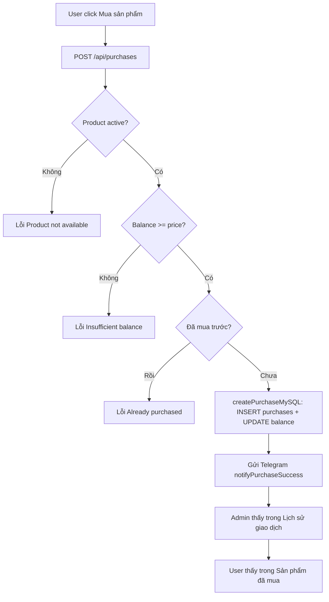
```mermaid
flowchart TD
    A[User click Mua sản phẩm] --> B[POST /api/purchases]
    B --> C{Product active?}
    C -->|Không| D[Lỗi Product not available]
    C -->|Có| E{Balance >= price?}
    E -->|Không| F[Lỗi Insufficient balance]
    E -->|Có| G{Đã mua trước?}
    G -->|Rồi| H[Lỗi Already purchased]
    G -->|Chưa| I[createPurchaseMySQL: INSERT purchases + UPDATE balance]
    I --> J[Gửi Telegram notifyPurchaseSuccess]
    J --> K[Admin thấy trong Lịch sử giao dịch]
    K --> L[User thấy trong Sản phẩm đã mua]
```

### 6. Sản phẩm đã mua
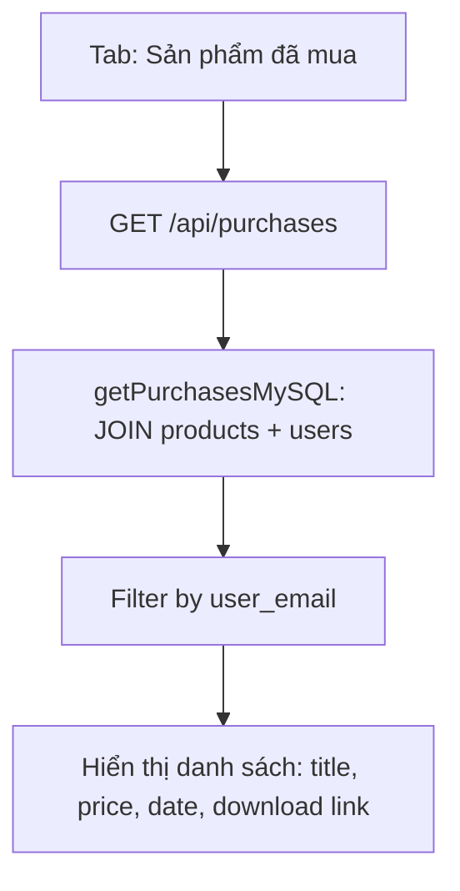
```mermaid
flowchart TD
    A[Tab: Sản phẩm đã mua] --> B[GET /api/purchases]
    B --> C[getPurchasesMySQL: JOIN products + users]
    C --> D[Filter by user_email]
    D --> E[Hiển thị danh sách: title, price, date, download link]
```

### 7. Tải xuống (Downloads)
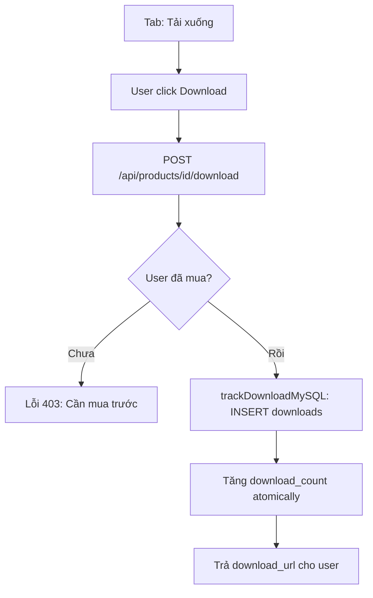
```mermaid
flowchart TD
    A[Tab: Tải xuống] --> B[User click Download]
    B --> C[POST /api/products/id/download]
    C --> D{User đã mua?}
    D -->|Chưa| E[Lỗi 403: Cần mua trước]
    D -->|Rồi| F[trackDownloadMySQL: INSERT downloads]
    F --> G[Tăng download_count atomically]
    G --> H[Trả download_url cho user]
```

### 8. Danh sách yêu thích (Wishlist)
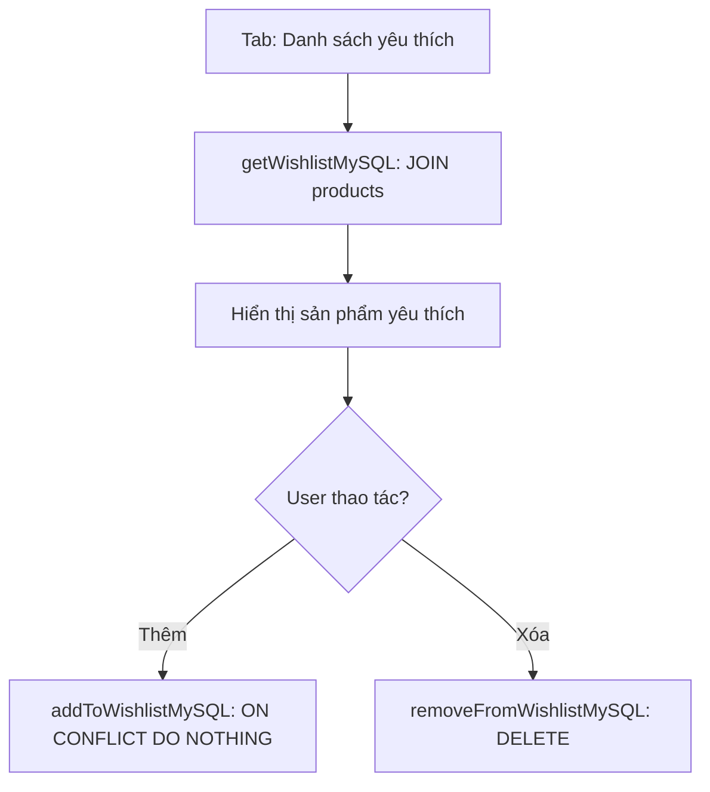
```mermaid
flowchart TD
    A[Tab: Danh sách yêu thích] --> B[getWishlistMySQL: JOIN products]
    B --> C[Hiển thị sản phẩm yêu thích]
    C --> D{User thao tác?}
    D -->|Thêm| E[addToWishlistMySQL: ON CONFLICT DO NOTHING]
    D -->|Xóa| F[removeFromWishlistMySQL: DELETE]
```

### 9. Đánh giá (Reviews)
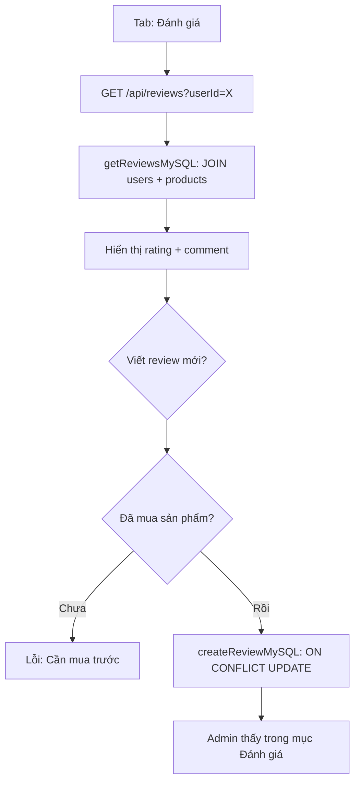
```mermaid
flowchart TD
    A[Tab: Đánh giá] --> B[GET /api/reviews?userId=X]
    B --> C[getReviewsMySQL: JOIN users + products]
    C --> D[Hiển thị rating + comment]
    D --> E{Viết review mới?}
    E --> F{Đã mua sản phẩm?}
    F -->|Chưa| G[Lỗi: Cần mua trước]
    F -->|Rồi| H[createReviewMySQL: ON CONFLICT UPDATE]
    H --> I[Admin thấy trong mục Đánh giá]
```

### 10. Lịch sử nạp/rút tiền
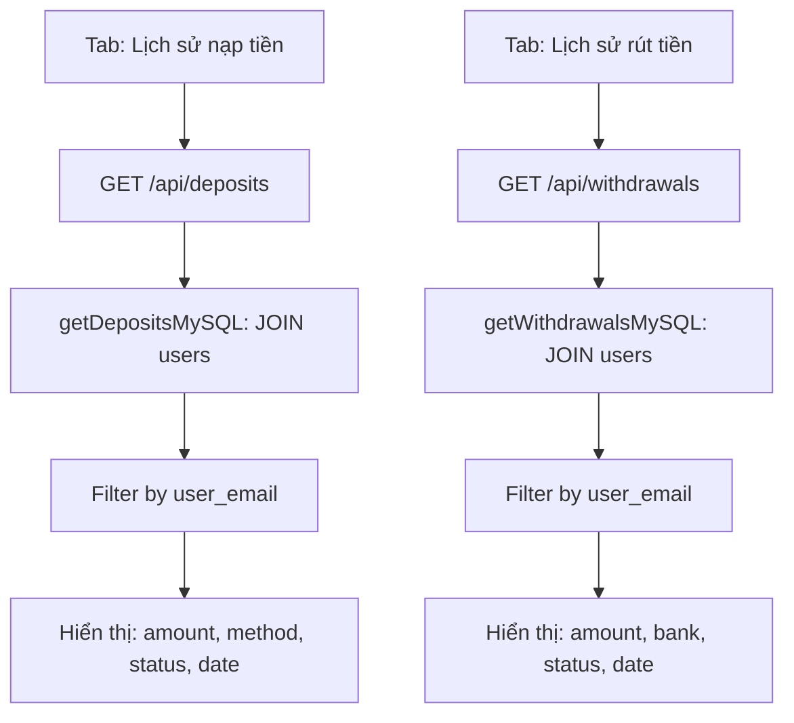
```mermaid
flowchart TD
    A[Tab: Lịch sử nạp tiền] --> B[GET /api/deposits]
    B --> C[getDepositsMySQL: JOIN users]
    C --> D[Filter by user_email]
    D --> E[Hiển thị: amount, method, status, date]
    F[Tab: Lịch sử rút tiền] --> G[GET /api/withdrawals]
    G --> H[getWithdrawalsMySQL: JOIN users]
    H --> I[Filter by user_email]
    I --> J[Hiển thị: amount, bank, status, date]
```

### 11. Thông báo (Notifications)
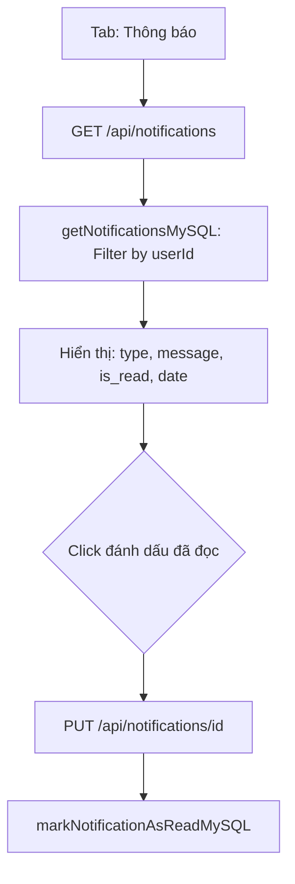
```mermaid
flowchart TD
    A[Tab: Thông báo] --> B[GET /api/notifications]
    B --> C[getNotificationsMySQL: Filter by userId]
    C --> D[Hiển thị: type, message, is_read, date]
    D --> E{Click đánh dấu đã đọc}
    E --> F[PUT /api/notifications/id]
    F --> G[markNotificationAsReadMySQL]
```

### 12-15. Thông tin cá nhân, Bảo mật, Giới thiệu, Mã giảm giá
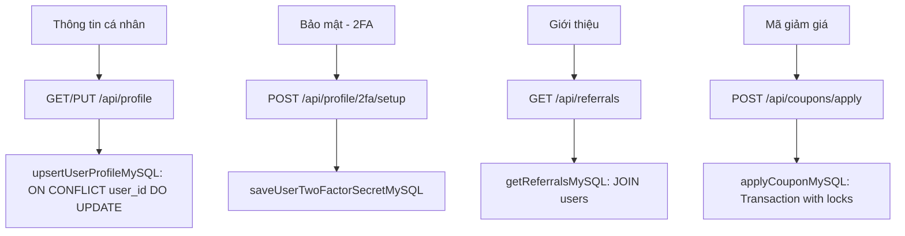
```mermaid
flowchart TD
    A[Thông tin cá nhân] --> B[GET/PUT /api/profile]
    B --> C[upsertUserProfileMySQL: ON CONFLICT user_id DO UPDATE]
    D[Bảo mật - 2FA] --> E[POST /api/profile/2fa/setup]
    E --> F[saveUserTwoFactorSecretMySQL]
    G[Giới thiệu] --> H[GET /api/referrals]
    H --> I[getReferralsMySQL: JOIN users]
    J[Mã giảm giá] --> K[POST /api/coupons/apply]
    K --> L[applyCouponMySQL: Transaction with locks]
```

---

## Flowchart: Admin Dashboard

### 1. Tổng quan / Bảng điều khiển
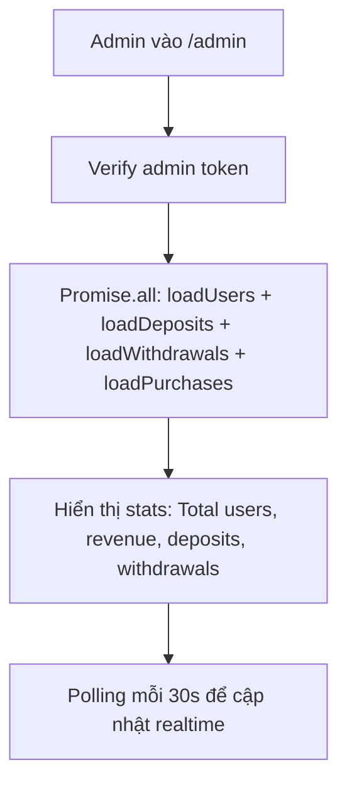
```mermaid
flowchart TD
    A[Admin vào /admin] --> B[Verify admin token]
    B --> C[Promise.all: loadUsers + loadDeposits + loadWithdrawals + loadPurchases]
    C --> D[Hiển thị stats: Total users, revenue, deposits, withdrawals]
    D --> E[Polling mỗi 30s để cập nhật realtime]
```

### 2. Sản phẩm (Products)
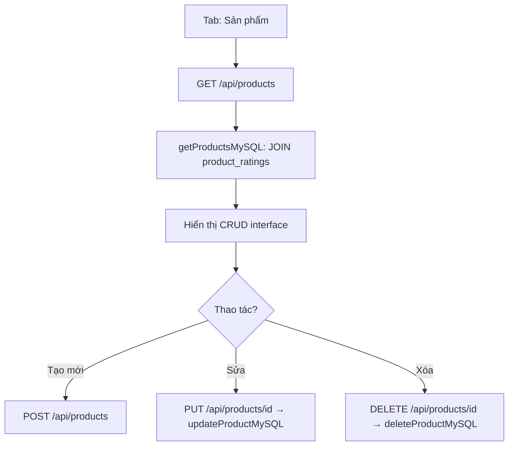
```mermaid
flowchart TD
    A[Tab: Sản phẩm] --> B[GET /api/products]
    B --> C[getProductsMySQL: JOIN product_ratings]
    C --> D[Hiển thị CRUD interface]
    D --> E{Thao tác?}
    E -->|Tạo mới| F[POST /api/products]
    E -->|Sửa| G[PUT /api/products/id → updateProductMySQL]
    E -->|Xóa| H[DELETE /api/products/id → deleteProductMySQL]
```

### 3. Thành viên (Members)
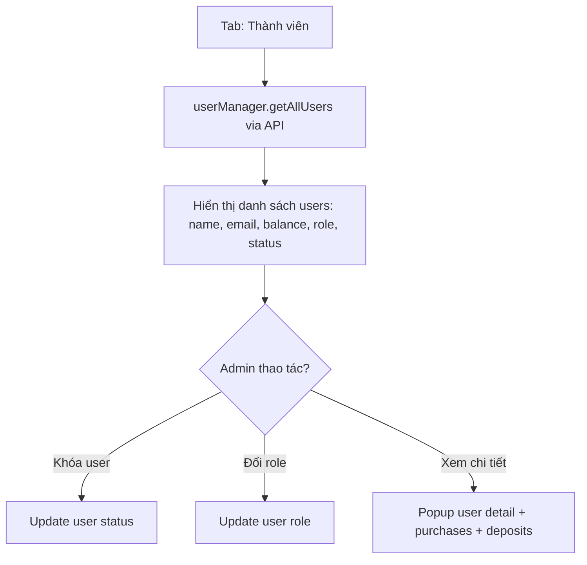
```mermaid
flowchart TD
    A[Tab: Thành viên] --> B[userManager.getAllUsers via API]
    B --> C[Hiển thị danh sách users: name, email, balance, role, status]
    C --> D{Admin thao tác?}
    D -->|Khóa user| E[Update user status]
    D -->|Đổi role| F[Update user role]
    D -->|Xem chi tiết| G[Popup user detail + purchases + deposits]
```

### 4. Nạp tiền / Rút tiền (Admin)
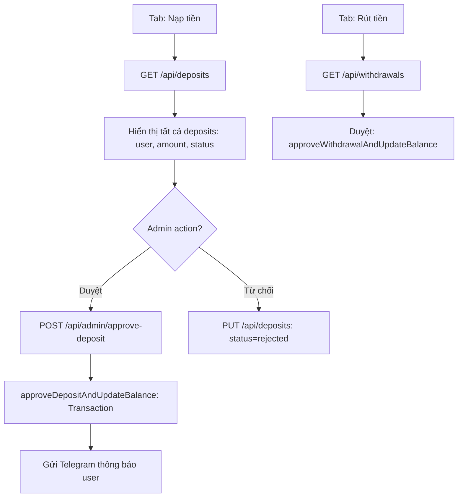
```mermaid
flowchart TD
    A[Tab: Nạp tiền] --> B[GET /api/deposits]
    B --> C[Hiển thị tất cả deposits: user, amount, status]
    C --> D{Admin action?}
    D -->|Duyệt| E[POST /api/admin/approve-deposit]
    E --> F[approveDepositAndUpdateBalance: Transaction]
    F --> G[Gửi Telegram thông báo user]
    D -->|Từ chối| H[PUT /api/deposits: status=rejected]
    I[Tab: Rút tiền] --> J[GET /api/withdrawals]
    J --> K[Duyệt: approveWithdrawalAndUpdateBalance]
```

### 5. Trò chuyện (Chat)
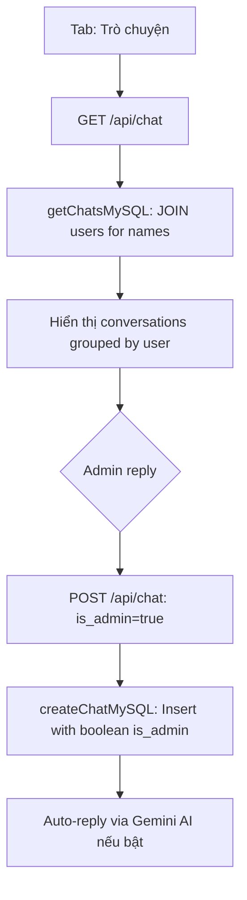
```mermaid
flowchart TD
    A[Tab: Trò chuyện] --> B[GET /api/chat]
    B --> C[getChatsMySQL: JOIN users for names]
    C --> D[Hiển thị conversations grouped by user]
    D --> E{Admin reply}
    E --> F[POST /api/chat: is_admin=true]
    F --> G[createChatMySQL: Insert with boolean is_admin]
    G --> H[Auto-reply via Gemini AI nếu bật]
```

### 6. Thông báo / FAQ / Audit / Khuyến mãi / Báo cáo / Backup
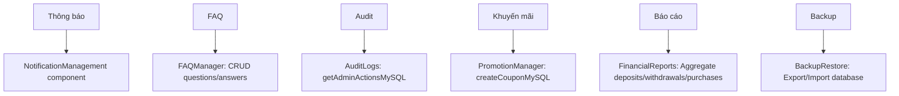
```mermaid
flowchart TD
    A[Thông báo] --> B[NotificationManagement component]
    C[FAQ] --> D[FAQManager: CRUD questions/answers]
    E[Audit] --> F[AuditLogs: getAdminActionsMySQL]
    G[Khuyến mãi] --> H[PromotionManager: createCouponMySQL]
    I[Báo cáo] --> J[FinancialReports: Aggregate deposits/withdrawals/purchases]
    K[Backup] --> L[BackupRestore: Export/Import database]
```

---

## Notification Flow Summary

| Event | Telegram | Admin Dashboard | Customer Dashboard |
|-|-|-|-|
| Nạp tiền | ✅ [notifyDepositRequest](file:///c:/Users/kirit/Desktop/Marketsource/lib/server-notifications.ts#46-71) | ✅ Tab Nạp tiền | ✅ Lịch sử nạp tiền |
| Rút tiền | ✅ [notifyWithdrawalRequest](file:///c:/Users/kirit/Desktop/Marketsource/lib/server-notifications.ts#72-97) | ✅ Tab Rút tiền | ✅ Lịch sử rút tiền |
| Mua hàng | ✅ [notifyPurchaseSuccess](file:///c:/Users/kirit/Desktop/Marketsource/lib/server-notifications.ts#127-145) | ✅ Lịch sử giao dịch | ✅ Sản phẩm đã mua |
| Đăng ký | ✅ [notifyNewUserRegistration](file:///c:/Users/kirit/Desktop/Marketsource/lib/server-notifications.ts#146-164) | ✅ Tab Thành viên | ✅ Welcome notification |
| Đăng nhập | — | — | ✅ Toast thông báo chào mừng |
| Admin duyệt nạp | ✅ Telegram | ✅ Status updated | ✅ Balance + notification |
| Admin duyệt rút | ✅ Telegram | ✅ Status updated | ✅ Balance + notification |

## Key Architecture

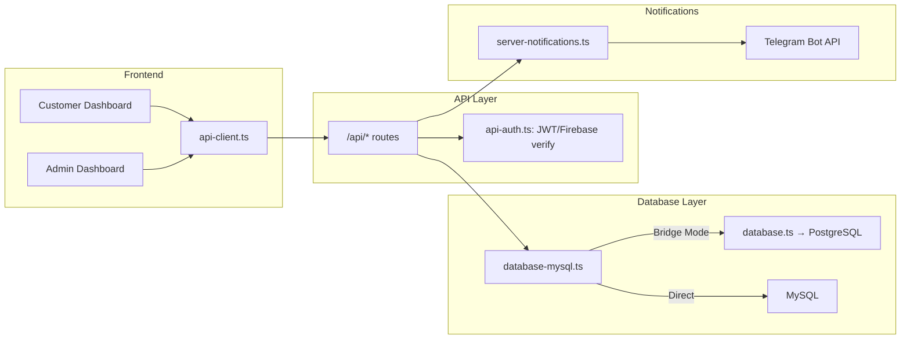
```mermaid
flowchart LR
    subgraph Frontend
        A[Customer Dashboard] --> C[api-client.ts]
        B[Admin Dashboard] --> C
    end
    subgraph API Layer
        C --> D["/api/* routes"]
        D --> E[api-auth.ts: JWT/Firebase verify]
    end
    subgraph Database Layer
        D --> F[database-mysql.ts]
        F -->|Bridge Mode| G[database.ts → PostgreSQL]
        F -->|Direct| H[MySQL]
    end
    subgraph Notifications
        D --> I[server-notifications.ts]
        I --> J[Telegram Bot API]
    end
```
